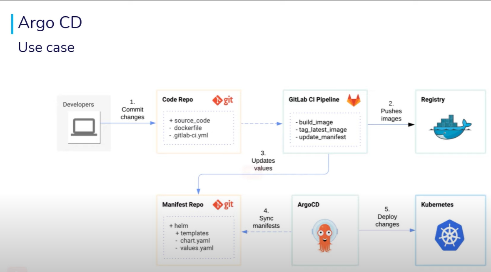
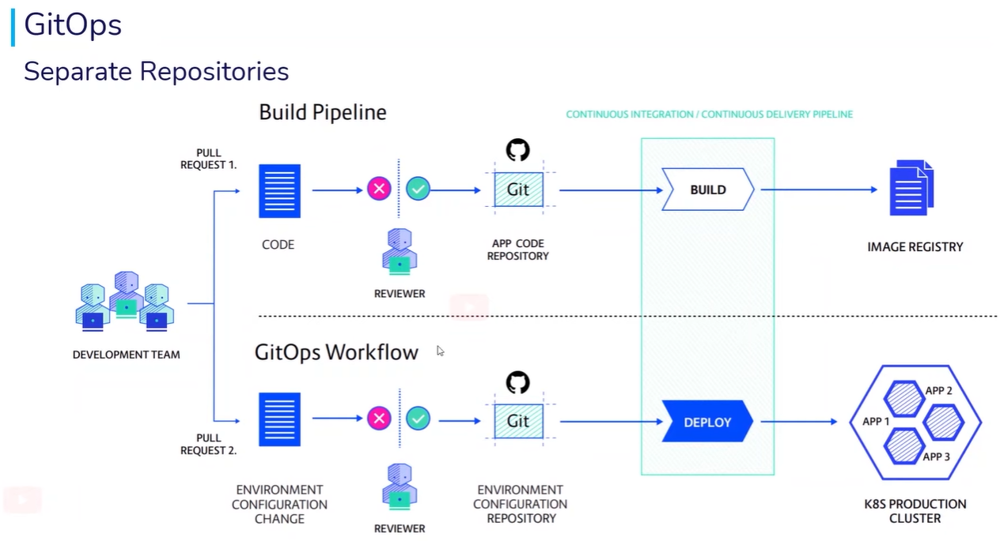

# GitOps Assignment

## Functional Specification





## Technical Specification

### EC2 Instances Scan Scheduler

- Python script that will scan AWS account for EC2 instances with the attributes:
    - `Name=tag:k8s.io/role/master,Values=1`
    - `Name=instance-state-code,Values=16`
- Utilizing [boto3](https://boto3.amazonaws.com/v1/documentation/api/latest/reference/services/ec2.html) library
- Instances that are found printed to `stdout` utilizing json format library ([python-json-logger](https://github.com/madzak/python-json-logger))

### EC2 Instance Setup

Create EC2 Instances for `Jenkins` and `Minikube Cluster`:

1. Follow official [Jenkins on AWS](https://www.jenkins.io/doc/tutorials/tutorial-for-installing-jenkins-on-AWS/) guide to set up `Jenkins`.

    - On the EC2 instance, after login run the following commands:
    ```commandline
    sudo su
    sudo yum update --assumeyes
    amazon-linux-extras install java-openjdk11 --assumeyes
    
    yum install docker --assumeyes
    systemctl status docker
    groupadd docker
    usermod --append --groups docker $USER
    newgrp docker
    
    wget -O /etc/yum.repos.d/jenkins.repo https://pkg.jenkins.io/redhat-stable/jenkins.repo
    rpm --import https://pkg.jenkins.io/redhat-stable/jenkins.io.key
    yum update --assumeyes
    yum install jenkins --assumeyes
    service jenkins start
    chkconfig jenkins on
    service jenkins status
    
    systemctl enable --now docker
    usermod --append --groups docker jenkins
    
    systemctl status docker
    
    yum install git --assumeyes
    ```

    - Navigate to `Jenkins` home page using EC2 `Public-IPv4-address` e.g. `http://<public-ipv4-address>:8080/`
    - Get initial password executing `cat /var/lib/jenkins/secrets/initialAdminPassword` and install suggested plugins

2. Follow official [minikube start](https://minikube.sigs.k8s.io/docs/start/) and [Installing kubeadm](https://kubernetes.io/docs/setup/production-environment/tools/kubeadm/install-kubeadm/) guides to start Minikube cluster

    - On the EC2 instance, after login run the following commands:
    ```commandline
    sudo su
    yum update --assumeyes
    yum install docker --assumeyes
    groupadd docker
    systemctl status docker
    usermod --append --groups docker $USER
    newgrp docker
    systemctl enable --now docker
    
    systemctl status docker
    
    cat <<EOF | sudo tee /etc/yum.repos.d/kubernetes.repo
    [kubernetes]
    name=Kubernetes
    baseurl=https://packages.cloud.google.com/yum/repos/kubernetes-el7-\$basearch
    enabled=1
    gpgcheck=1
    gpgkey=https://packages.cloud.google.com/yum/doc/rpm-package-key.gpg
    EOF
       
    yum install kubectl --assumeyes
    
    curl -LO https://storage.googleapis.com/minikube/releases/latest/minikube-linux-amd64
    install minikube-linux-amd64 /usr/bin/minikube
    
    yum install conntrack-tools --assumeyes
    
    minikube start
    ```

3. Commit source code to GitHub
4. Create `GitHub` (Personal access tokens) and `DockerHub` (Access Token) to be used with Jenkins global credentials (see: [jenkins-github-cred](attachments/jenkins-github-cred.jpg) and [jenkins-dockerhub-cred](attachments/jenkins-dockerhub-cred.jpg) resulting [global-credentials](attachments/global-credentials.jpg))
5. Configure pipeline (see: [jenkins-pipeline](attachments/jenkins-pipeline.jpg))
6. [Configure GitHub Webhook](https://plugins.jenkins.io/github/)
7. Install `ArgoCD` on the Minikube cluster following [getting-started guide](https://argo-cd.readthedocs.io/en/stable/getting_started/#getting-started)
8. In ArgoCD, connect repo and then create `NEW APP` (see: [argocd-connect-repo](attachments/argocd-connect-repo.jpg), [argo-cd-config](attachments/argocd-config.jpg))
9. Add AWS credentials (Base64 encoded into `helm-k8s-test-app/templates/secret.yaml`) and push code to GitHub (use `credentials` template file in root project)
10. Manually merge `development` branch into master ([jenkins-pipeline](attachments/jenkins-pipeline-2.jpg), [development branch merged to master](attachments/github-merge.jpg))
11. Check `ArgoCD` is synchronized and script in running ([argocd-in-action](attachments/argocd-in-action.jpg), [running-script-in-action](attachments/running-script-in-action.jpg))
12. Push changes to `development` branch
13. Define webhook trigger only for PR from `development` to `master` (Generic Webhook Trigger Plugin)

### References

- [boto3](https://boto3.amazonaws.com/v1/documentation/api/latest/reference/services/ec2.html)
- [Python Json Logger Library](https://github.com/madzak/python-json-logger)
- [Jenkins on AWS](https://www.jenkins.io/doc/tutorials/tutorial-for-installing-jenkins-on-AWS/)
- [Minikube docs](https://minikube.sigs.k8s.io/docs/start/)
- [minikube start](https://minikube.sigs.k8s.io/docs/start/)
- [Installing kubeadm](https://kubernetes.io/docs/setup/production-environment/tools/kubeadm/install-kubeadm/)
- [Configure GitHub Webhook](https://plugins.jenkins.io/github/)
- [DockerHub - Manage access tokens](https://docs.docker.com/docker-hub/access-tokens/)
- [Base64 encode/decode](https://www.base64encode.org/)
